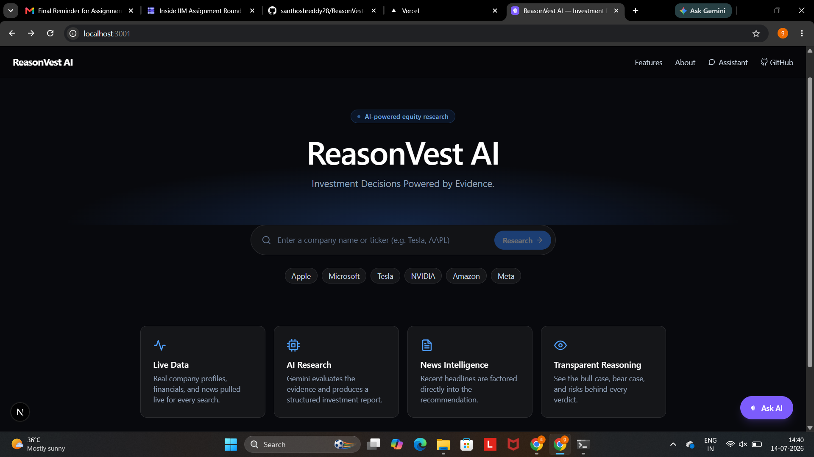
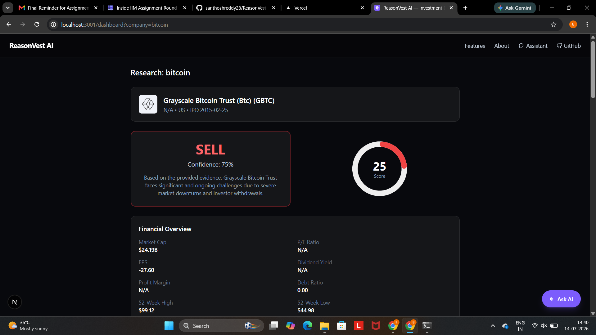
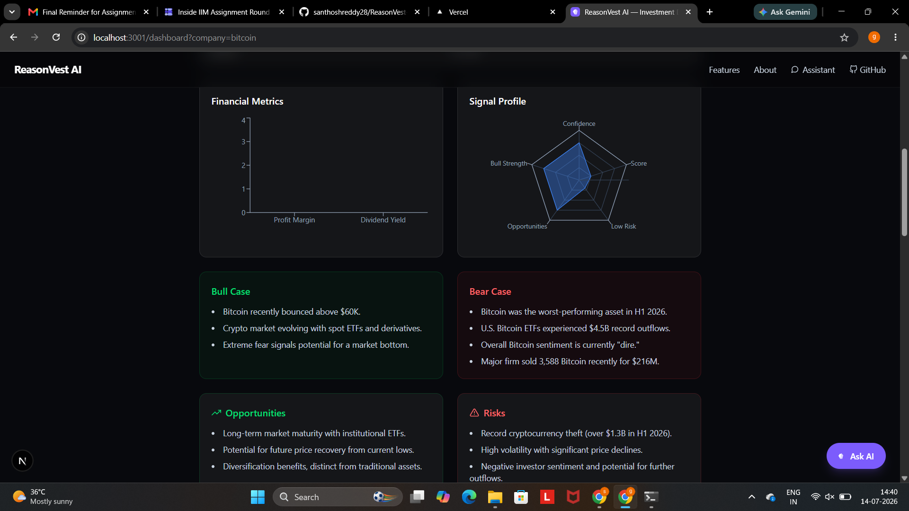
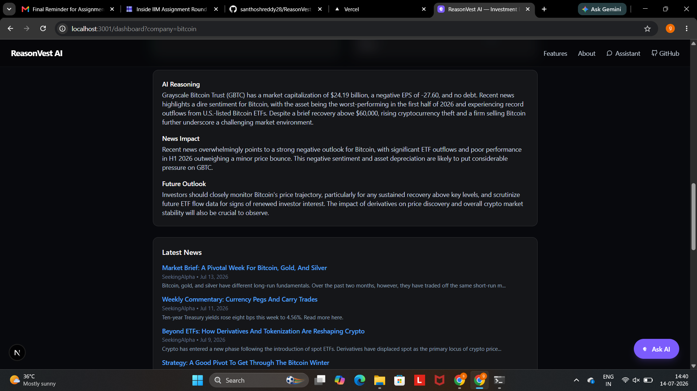
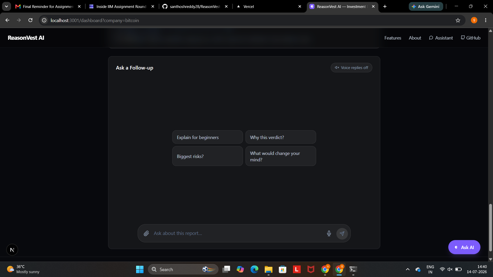
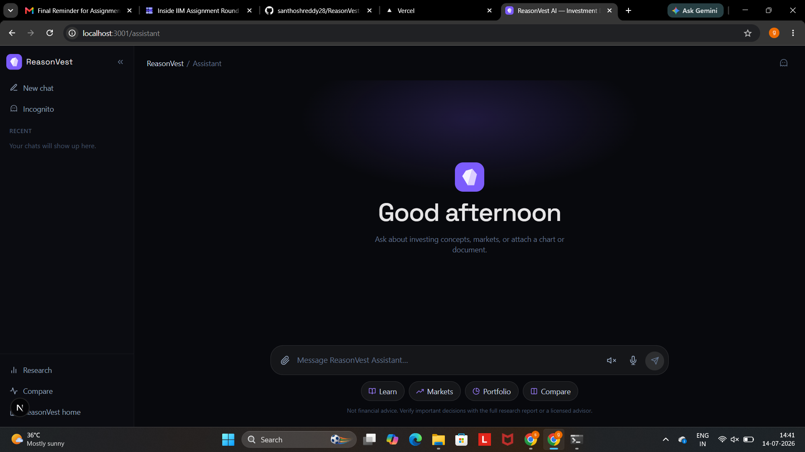
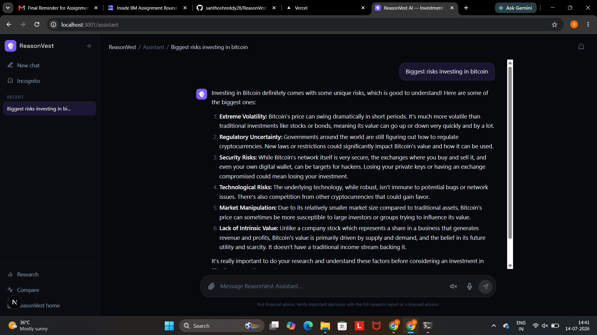
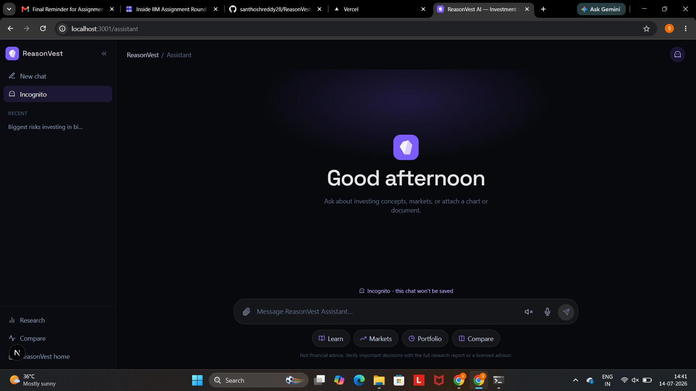
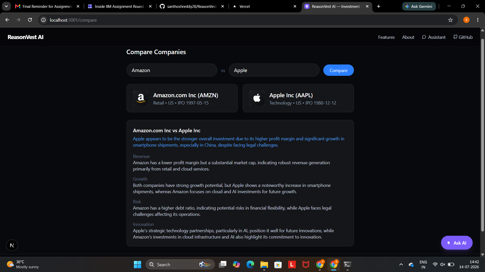

# ReasonVest AI

**Investment Decisions Powered by Evidence.**

An AI investment research platform. Enter a public company, and it pulls live
company data, financials, and news, then has an AI model evaluate the
evidence and produce a structured investment report — recommendation,
confidence, bull case, bear case, risks, opportunities, and reasoning. Not a
chatbot: an agent that performs a research task and explains its answer.

## Features

- Live company search, profile, and financial metrics (Finnhub, with an
  automatic Alpha Vantage fallback)
- Live recent news (Finnhub, with an automatic NewsAPI fallback), factored
  into the AI's analysis
- AI-generated investment report: recommendation (BUY/HOLD/SELL), confidence,
  investment score, bull case, bear case, risks, opportunities, news impact,
  verdict, future outlook
- Animated loading timeline, score gauge, bar chart, and radar chart
- Follow-up chat grounded in the same report (e.g. "explain for beginners")
- **AI Assistant** (`/assistant`, and the "Ask AI" button on every page): a
  full-page, Gemini-style chat with the same assistant used for follow-up
  questions, but general-purpose and not tied to one report
  - **Voice both ways** - press the mic to speak your question (browser
    SpeechRecognition transcribes it live); toggle "Voice replies" to have
    the assistant read its answers back out loud (browser SpeechSynthesis)
  - **Attachments** - attach images (PNG/JPEG/WEBP/GIF) or documents
    (PDF/TXT/CSV/MD), up to 4 files / 10MB each, sent to the AI as
    multimodal input alongside your question
  - Markdown-rendered replies, copy-to-clipboard, per-message "read aloud",
    and suggested starter prompts
- Compare two companies side by side
- **Automatic AI provider fallback** (Gemini → OpenRouter) and **automatic
  market-data fallback** (Finnhub → Alpha Vantage / NewsAPI) - a single
  provider being down, rate-limited, or out of quota degrades gracefully
  instead of breaking the app
- **Report caching** - identical searches within 15 minutes skip the full
  pipeline (including the AI call) entirely; cached in-process, with an
  optional MongoDB tier that's shared across server instances

---

# 📸 Screenshots

## 🏠 Landing Page

AI-powered investment research homepage with live company search.

<p align="center">
  
</p>

---

## 📊 Investment Research Report

The AI generates an investment recommendation with confidence score, investment score, and key financial metrics.

<p align="center">
  
</p>

---

## 📈 Financial Analysis

Bull case, bear case, opportunities, risks, radar chart, and financial metrics.

<p align="center">
  
</p>

---

## 🧠 AI Reasoning

Transparent reasoning, market outlook, and latest news used by the AI to justify its recommendation.

<p align="center">
  
</p>

---

## 💬 Follow-up Investment Chat

Continue asking questions about the generated investment report using the embedded AI assistant.

<p align="center">
  
</p>

---

## 🤖 Standalone AI Assistant

General-purpose investment assistant with voice input, file attachments, markdown rendering, and conversation history.

<p align="center">
  
</p>

---

## 📝 AI Conversation

Example interaction with the assistant answering investment-related questions.

<p align="center">
  
</p>

---

## 👻 Incognito Mode

Incognito conversations are not saved to local history.

<p align="center">
  
</p>

---

## ⚖️ Company Comparison

Side-by-side AI comparison of two companies using live financial data and AI reasoning.

<p align="center">
  
</p>

---

# 📄 Additional Documentation

The repository also includes supporting documentation inside the `docs` folder.

- **Example-Runs.pdf** – Complete working examples of the AI Investment Research Agent.
- **LLM-Development-Log.pdf** – ChatGPT / Claude development conversations used while building the project.
- **screenshots/** – High-resolution screenshots of the application.
  

## Tech Stack

Next.js 16 (App Router) · React 19 · TypeScript (strict) · Tailwind CSS 4 ·
Framer Motion · Recharts · React Icons · React Markdown · LangGraph.js ·
Zod · MongoDB · Gemini API · OpenRouter API · Finnhub API · Alpha Vantage API
· NewsAPI

**Note on Axios:** it's installed (per spec) but the actual implementation
uses native `fetch` throughout, since it needs no extra config in Next.js/
Node and every service already follows the same request/error-handling
pattern (see "Reliability & Error Handling" below). Swapping to Axios is a
mechanical change if you want it explicitly.

## Architecture

```
        START
          |
       validate            <- resolves free-text name -> ticker
        / | \                  (Finnhub, falls back to Alpha Vantage)
 fetchProfile fetchFinance fetchNews   <- run IN PARALLEL (only depend on the
        \ | /                              ticker from validate, not each other)
        analyze             <- askAI() call, strict JSON contract
          |
         END
```

This is a genuine multi-node LangGraph.js workflow, not a single prompt: after
the company is validated, the profile/financial/news lookups run in parallel
because none of them depend on each other's output — only on the resolved
ticker. The `analyze` node waits for all three before calling the AI layer.
This is the real reason to use LangGraph here instead of one long prompt or a
plain linear chain.

Follow-up chat (`/api/chat`) and comparison (`/api/compare`) are separate,
simpler routes: chat re-uses the already-generated report as grounding
context, and compare runs the full pipeline twice in parallel (`Promise.all`)
before asking the AI layer for a head-to-head verdict.

### Reliability & Error Handling

Every external call in this app - AI or market data - goes through the same
shape: try the primary source, retry it a couple of times on a transient
failure (429/500/502/503/timeout, with exponential backoff + jitter), and if
it's still failing, fall back to a secondary source when one is configured.

```
AI:      Gemini ──(retry ×3)──> fails ──> OpenRouter ──(retry ×3)──> fails ──> AIError
Data:    Finnhub ──(retry ×3)──> fails ──> Alpha Vantage / NewsAPI ──(retry ×3)──> fails ──> ProviderError
```

Every route handler funnels its catch block through one function,
`toErrorResponse()` (`lib/http.ts`), which is the single place that decides
what an error looks like on the wire:

- A known, expected failure (`AppError` and its subclasses -
  `ValidationError`, `ProviderError`, `AIError`) returns its own safe,
  already-written client message and the right HTTP status.
- Anything unanticipated is logged with full detail server-side and returns
  a generic `"Something went wrong"` - the client never sees a raw stack
  trace, a raw upstream error body, or an upstream service's own HTTP status
  code (an upstream 403/429 becomes a 502 on **our** API, since that upstream
  failure is a fact about our server's dependencies, not about the caller's
  request).

Every provider call is logged with a leveled, scannable format
(`lib/logger.ts`) so a real outage is visible at a glance in server logs:

```
🟡 [AI] Gemini quota exceeded
🔵 [AI] Falling back to OpenRouter
🟢 [AI] OpenRouter succeeded
```

**If you hit a raw `429 RESOURCE_EXHAUSTED` error from Gemini:** that's
Google's free tier, which caps `gemini-2.5-flash` at a small number of
requests per day - it's not specific to any one company you search, it's
whichever request happens to land after that day's quota is used up. Two
ways to fix it: enable billing on the Google AI Studio project backing your
`GEMINI_API_KEY` for a much higher quota, or set `OPENROUTER_API_KEY` so the
app automatically falls back to a different model the instant Gemini's quota
is hit, instead of the request failing.

## Project Structure

```
config/
  env.ts                    - Zod-validated environment, readable startup errors

lib/
  errors.ts                 - AppError, ValidationError, ProviderError, AIError
  logger.ts                 - 🟢🟡🔵🔴 leveled logger
  http.ts                   - toErrorResponse(): the one place errors become HTTP responses
  retry.ts                  - retry(), fetchWithTimeout(), isRetryableStatus()
  withFallback.ts            - generic ordered-fallback runner (used by the data layer)
  requestSchemas.ts           - Zod schemas + parseRequest() for every route body
  cache/memoryCache.ts         - in-process TTL cache
  cache/reportCache.ts          - two-tier (memory + optional Mongo) report cache
  db/mongoClient.ts              - lazy, connection-reusing Mongo client
  constants.ts, helpers.ts        - formatting, file->base64, markdown-stripping for speech
  hooks/useSpeechRecognition.ts    - voice input (browser SpeechRecognition)
  hooks/useSpeechSynthesis.ts       - voice output (browser SpeechSynthesis)

services/
  ai/                        - provider-agnostic AI layer; askAI() is the ONLY
                                function the rest of the app calls for AI output
    aiService.ts                - askAI(), askAISimple(), askAIJson()
    providers.ts                  - fallback chain orchestrator (Gemini -> OpenRouter)
    gemini.ts, openrouter.ts        - one AIProvider implementation each
    types.ts                          - every AI-layer interface
    prompts.ts                          - every prompt template + sanitizeUserInput()
    retry.ts                              - re-exports lib/retry.ts at this layer's expected path

  data/                       - the SAME provider-agnostic pattern, for market data
    finnhub/{finnhubClient,companyService,profileService,financeService,newsService}.ts
    alphaVantage.ts, newsApi.ts   - fallback sources
    companyDataService.ts, profileDataService.ts,
    financeDataService.ts, newsDataService.ts   - fallback orchestrators

  research/
    researchPipeline.ts       - the LangGraph.js workflow (now cached + typed)
    compareService.ts           - the compare feature's logic (extracted from its route)

app/
  api/research/route.ts     - validates input, calls runResearchPipeline()
  api/chat/route.ts          - follow-up Q&A grounded in a report (+ attachments)
  api/assistant/route.ts      - general assistant chat (history + attachments)
  api/compare/route.ts         - validates input, calls compareCompanies()
  dashboard/page.tsx        - results page (reads ?company= from the URL)
  compare/page.tsx           - side-by-side comparison page
  assistant/page.tsx          - full-page Gemini-style AI Assistant
  page.tsx                     - landing page

components/                - UI components, including components/assistant/
                              (the shared voice+attachment chat UI) and
                              AssistantFAB.tsx (the floating "Ask AI" button)

types/                     - Company, CompanyProfile, FinancialMetrics,
                              NewsArticle, AIAnalysis, ResearchReport,
                              ComparisonResult, ChatMessage, ChatAttachment
                              (+ speech.d.ts: ambient typings for the Web Speech API)
```

Every public interface lives in a `types.ts` for its layer (app-wide domain
types in `types/`, AI-layer types in `services/ai/types.ts`). The one
exception: a vendor's raw wire-format interface (Gemini's JSON shape,
Finnhub's JSON shape, etc.) stays private/unexported inside that vendor's own
file - it's an implementation detail of talking to that one API, not
something anything else in the app should ever import or depend on.

## Installation

```bash
npm install
cp .env.example .env.local
# fill in .env.local with real keys, then:
npm run dev
```

## Environment Variables

| Variable | Required? | Enables | Where to get it |
|---|---|---|---|
| `GEMINI_API_KEY` | **Required** | Primary AI provider | https://aistudio.google.com/apikey |
| `FINNHUB_API_KEY` | **Required** | Primary market-data provider | https://finnhub.io/register |
| `OPENROUTER_API_KEY` | Optional | Automatic AI fallback if Gemini fails | https://openrouter.ai/keys |
| `ALPHAVANTAGE_API_KEY` | Optional | Automatic fallback for company search, profile, and financials | https://www.alphavantage.co/support/#api-key |
| `NEWS_API` | Optional | Automatic fallback for company news | https://newsapi.org/register |
| `MONGODB_URI` | Optional | Cross-instance report caching (works fine without it - memory-only caching still applies) | Any MongoDB connection string |

Validated at request time by `config/env.ts` (Zod) - a missing required key
throws one readable error naming exactly what's missing, instead of a
confusing failure deep inside whichever service happens to need it first.

## AI Provider Layer

Every prompt template lives in `services/ai/prompts.ts` and explicitly
instructs the model not to invent facts beyond the evidence it's given, and
(for the analysis/compare prompts) to respond in strict JSON so the app can
parse it into typed data instead of displaying raw AI text -
`generationConfig.responseMimeType: "application/json"` is what actually
constrains this; prompt wording alone isn't reliable. `askAIJson()` in
`services/ai/aiService.ts` handles the parsing and throws a clear `AIError`
- not a silent `null` - if the model's response still isn't valid JSON.

Free-text user input (a chat question, an assistant message) is passed
through `sanitizeUserInput()` before being sent to the AI - a best-effort
mitigation for prompt injection (bounding length, defanging fake
role/section markers), not a guarantee; an LLM has no hard boundary between
"instructions" and "data" the way a parameterized query does, so the prompt
templates' own framing is still doing most of the real work.

## Trade-offs & Known Limitations

These were real engineering decisions, not oversights — documented here
rather than hidden:

- **CEO name isn't available.** Neither Finnhub's free `profile2` nor Alpha
  Vantage's `OVERVIEW` endpoint returns a CEO field on the free tier. Shown
  as "Unknown" rather than guessed.
- **No historical revenue line chart.** None of the free-tier endpoints in
  use return raw historical revenue, only ratios (P/E, margins, etc.). A real
  revenue trend chart would need a heavier financials-statements endpoint -
  not wired up here, to avoid faking a chart with invented numbers.
- **OpenRouter's fallback doesn't get Gemini's document understanding.**
  When OpenRouter is used as a fallback, non-image attachments (PDF/text)
  aren't forwarded to it - not every fallback-capable model handles
  documents the way Gemini does, and silently dropping an unsupported
  attachment is safer than sending one the model can't use. Images still
  work on both providers.
- **Alpha Vantage's free tier is rate-limited (25 requests/day, 5/minute)**,
  same category of limitation as Gemini's free tier - it's a real fallback,
  but under heavy load it can also run out. `NEWS_API`'s free tier is
  capped similarly (100 requests/day).
- **Voice input browser support varies.** The mic button uses the
  `SpeechRecognition` Web API, which Chrome and Edge support well but
  desktop Firefox doesn't implement at all. The mic button is
  feature-detected and hides itself rather than showing something broken -
  on unsupported browsers, typing still works normally. Voice *output*
  (`speechSynthesis`) is supported far more broadly and isn't gated the
  same way.
- **Attachments use inline base64, not the Gemini Files API.** Simpler and
  needs no extra upload step, but caps attachments at ~10MB each (well
  under Gemini's ~20MB inline request-size ceiling) rather than supporting
  large files. Fine for chart screenshots and short filings; a video or a
  100-page PDF would need the Files API instead.
- **Report cache is time-based (15 min), not invalidated on new news.** A
  cache hit could theoretically miss a news story that broke in the last few
  minutes. 15 minutes was chosen as a reasonable balance for a research tool
  (not a live trading feed); shorten `TTL_MS` in `lib/cache/reportCache.ts`
  if fresher-but-slower is preferred.

### Bugs found and fixed after a real run against live keys

- **LangGraph node/state name collision**: a node named `profile` (etc.)
  can't coexist with a state field of the same name. Renamed nodes to
  `fetchProfile`/`fetchFinance`/`fetchNews`.
- **Missing Suspense boundary**: `useSearchParams()` on the dashboard page
  needs to be wrapped in `<Suspense>` for Next.js to prerender it.
- **Analysis always fell back to HOLD/50/50 with empty bull/bear/risks**:
  root cause was that Gemini returns unstructured text *by default* -
  instructing it via prompt text alone ("respond only with JSON") isn't
  reliable. Fixed by setting `generationConfig.responseMimeType:
  "application/json"` on the actual API request (`services/ai/gemini.ts`'s
  `jsonMode` option), which constrains generation itself.
- **Market Cap displayed incorrectly**: Finnhub's `marketCapitalization`
  field is returned in **millions**, not raw dollars (confirmed against real
  examples - e.g. `21794.52` for a company worth ~$21.8B). Fixed by
  multiplying by 1,000,000 in both `financeService.ts` and `profileService.ts`.
- **Dividend yield / profit margin were being double-converted**: Finnhub's
  values are already percentages (e.g. `2.5` means 2.5%); Alpha Vantage's
  equivalents are 0-1 fractions. Each provider's own service now normalizes
  to the same unit (percentage) before returning, so it's correct regardless
  of which provider actually answered.
- **Raw upstream errors reaching the user** (found via a live 429 quota
  error from Gemini reaching the chat UI as an unformatted JSON dump): every
  route now funnels errors through `toErrorResponse()`, which never returns
  a raw provider error to the client - only a safe, pre-written message.
- **Upstream status codes were leaking through as OUR API's status code**
  (found during this refactor's own testing: a bad upstream key returned a
  raw `403`/`429` as if it were describing the caller's request to *our*
  API). `ProviderError` now always defaults to `502` for the client-facing
  response regardless of the upstream's specific status - the real upstream
  status is preserved in the message and server logs for debugging, just
  not promoted to be our own response's status.

## AI Assistant Redesign (Claude-style interface)

The `/assistant` page got a full visual and functional pass toward a
Claude-style shell — a collapsible icon rail, a big empty-state brand
moment, pill-style starter prompts, GFM-formatted replies, and a genuinely
functional incognito mode with local history. Built in two passes: an
initial redesign, then a second pass that tightened accent-color
consistency, added rename/undo-delete to local history, and covered
accessibility/performance/typing-animation requirements from a follow-up
spec. Where the two passes' source briefs disagreed (Perplexity vs.
Claude as the visual reference; whether "Invexa" replaces the product
name), the more recent, more explicit instruction won each time.

### Architecture
- **Brand mark** (`components/BrandMark.tsx`): one SVG component, an
  asymmetric two-facet gem glyph — a deliberate alternative to the two
  clichés this space defaults to (a bar-chart glyph for finance apps, a
  four-point sparkle for AI products). `glyphOnly` renders just the
  glyph in `currentColor` for inline use next to text; the default badge
  form is used everywhere else: empty-state hero, message avatar
  (including the loading state), sidebar mark, the `Ask AI` floating
  button, and `app/icon.svg` (the browser tab icon). Memoized with
  `React.memo` since it's pure and renders once per message.
- **One signature color** (`--brand-500`, `#7C5CFC`, defined once in
  `app/globals.css`): used, with no exceptions, for the mark's badge
  fill, the send button, focus rings, the active sidebar item, the
  voice-input/voice-reply active states, suggestion-pill hover accents,
  and text-selection highlighting on this page (via a `[data-assistant-
  scope] ::selection` rule, so it doesn't recolor selection on the rest
  of the site). Kept as its own token rather than reusing `--glow-accent`
  (the landing page's existing blue glow).
- **Shell** (`components/assistant/AssistantSidebar.tsx`,
  `app/assistant/page.tsx`): a collapsible icon rail (New chat, Incognito,
  Recent conversations with inline rename/delete, quick nav to
  Research/Compare/Home), a mobile overlay-drawer version (closes on
  Escape as well as backdrop click), and a slim top bar with a desktop
  breadcrumb (`ReasonVest / Assistant / <conversation title>`) plus a
  second incognito toggle in the corner.
- `AssistantChat.tsx` gained a `variant: "embedded" | "full"` prop rather
  than a rewrite — `"embedded"` is the exact original compact-card look
  the dashboard/report follow-up chat (`ChatSection.tsx`) already uses,
  unchanged; `"full"` is the hero treatment on `/assistant`. Both share
  the same send/history/markdown/typing-animation logic underneath -
  there is one chat implementation, not a fork.
- **Voice**: input and output already existed
  (`lib/hooks/useSpeechRecognition.ts` / `useSpeechSynthesis.ts`) and
  weren't rebuilt - only repositioned (into the composer, next to the
  mic) and recolored to the accent above.
- **Markdown**: `AssistantMarkdown.tsx` now runs `remark-gfm`, so tables,
  strikethrough, and autolinks in a reply actually render as tables etc.
  instead of raw pipe-delimited text - previously missing entirely, since
  plain `react-markdown` only parses CommonMark.

### Incognito mode
Real, not decorative. Toggling it starts a fresh thread (rather than
flipping mid-conversation, which would leave it ambiguous whether
already-sent messages count as "seen"); while active, nothing from that
thread is written to local history at all, and the sidebar/top-bar both
show a ghost icon plus a small "won't be saved" label so it's never a
silent mode.

### Local conversation history
There's no auth or database wired up for the assistant yet, so
`lib/hooks/useConversationHistory.ts` persists conversations to
`localStorage` (`useSyncExternalStore`-backed, so multiple components stay
in sync without prop-drilling a context). It supports the full set asked
for: stable ids, `updatedAt` timestamps, auto-generated titles (first user
message, truncated), manual rename (inline edit in the sidebar, commit on
Enter/blur, cancel on Escape), delete, a one-slot "undo" for the most
recent delete (a 6-second "Deleted \"X\" · Undo" banner), and sorting by
recency. The `StoredConversation` shape (`types/chat.ts`) already matches
what a `conversations` Mongo collection's documents would look like minus
`userId`, so swapping this hook for an API-backed one later is a contained
change, not a redesign.

### Chat rendering
Beyond markdown/tables above: a lightweight typewriter reveal
(`lib/hooks/useTypewriter.ts`) plays once for a reply that arrives live
during the current session; a message resumed from saved history renders
instantly instead of replaying. `MessageBubble.tsx` is memoized with a
stable, index-based `onSpeak` callback (rather than a fresh closure built
per row) so that memoization actually skips re-rendering earlier messages
when unrelated state (`isLoading`, a new message arriving) changes.

### Accessibility
Every icon-only control has an `aria-label` (or `title` when collapsed,
for the rail); toggles expose `aria-pressed`; the message list is an
`aria-live="polite"` region so screen readers announce new replies; the
mobile drawer closes on Escape in addition to a backdrop click; recent-
conversation rows are real `<button>` elements (not a clickable `<div>`),
with rename/delete as sibling buttons rather than nested inside one,
since a `<button>` can't validly contain another interactive element.

### Trade-offs
- **Typing animation, not token streaming.** `services/ai/*` returns one
  complete response - there's nothing to stream from without changing
  that layer, which this redesign was explicitly told not to touch. The
  reveal effect slices already-arrived markdown text a few words at a
  time, which means a bold/code/table marker can render unclosed for a
  tick before the rest catches up. Brief and cosmetic - the same visual
  hiccup real token-streaming UIs have too - but worth naming since it's
  an animation over arrived text, not a stream.
- **No user avatar.** There's no signed-in identity to show one for;
  adding a placeholder avatar with nothing real behind it would be exactly
  the "fake UI" this pass was told to avoid, so user messages stay
  avatar-less (matching the Claude reference, which does the same).
- **"Restore" read as undo-delete**, not "resume a saved chat" (the
  sidebar's click-to-resume already covered that separately) - the source
  spec listed it directly after "delete" in a way that reads as recovery,
  not navigation. Flagging the read in case that's not what was meant.

### Kept unchanged, on purpose
`services/ai/*`, `services/data/*`, `services/research/*`, the product
name ("ReasonVest AI" everywhere - metadata, navbar, package name, this
README), and the dashboard/compare/report-grounded chat flows, which use
the same `AssistantChat` component via `variant="embedded"` and render
exactly as they did before this redesign.

### Still open
- Google sign-in (Auth.js + `@auth/mongodb-adapter`) - needs real
  `GOOGLE_CLIENT_ID` / `GOOGLE_CLIENT_SECRET` / `AUTH_SECRET` values to
  test end-to-end, so it wasn't started here.
- Swapping `useConversationHistory`'s localStorage backing for a Mongo
  `conversations` collection once sign-in exists.
- The cosmetic "Invexa 1/2/3" model selector and AI-generated
  "Follow-ups" from the original brief weren't built - both were flagged
  there as needing a cosmetic-vs-functional decision that neither
  follow-up revisited.

## Future Improvements

- Real historical financials (revenue/earnings trend over time)
- Streaming the pipeline's progress to the frontend instead of a cosmetic
  step timer
- Persisting past reports so users can revisit them without re-running
  (the MongoDB connection is already wired up for caching - a small step
  from there to a proper "saved reports" collection)
- A third+ AI provider in the fallback chain (Groq, Claude, GPT) - adding
  one is a single new file implementing `AIProvider` plus one line in
  `services/ai/providers.ts`
